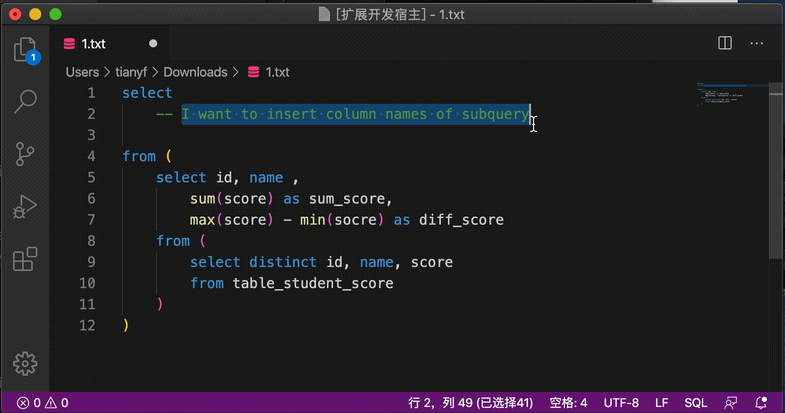

# Find SQL Column README

在编写sql过程中，经常需要从子查询语句中选择所有/部分的列名，该VS Code插件可以自动生成和插入所有的子查询列名



## 安装

暂未发布，可以离线安装使用

如果系统为Mac/Linux：

```shell
cd $HOME/.vscode/extensions
git clone git@github.com:luckcul/Find-SQL-Column.git
```

如果为Windows，同样将该repo复制到`%USERPROFILE%\.vscode\extensions`

## 使用

在需要自动生成sql字段名的位置，先通过`Ctrl+Shift+P` 或 `Cmd+Shift+P`（Mac下），然后输入`SQL COLUMN`

Q：为什么不直接使用`*`来获取列名？

A：当然可以直接使用`*`，但是经常需要重新排列或插入一些新的字段。例如子查询中有`a, b, c` 三个字段，而我想进行操作` select a, b, a/b as ratio, c from …`，这种情况下直接生成所有字段，就可以提高编写效率

**Enjoy!**

